# ♾️ The Autonomous Content Loop: Comprehensive Guide

> **Version:** 1.0.0
> **Status:** Production Ready
> **Workflow:** `/content-loop`

## 📖 Overview

The **Content Loop** is a self-correcting, autonomous publishing pipeline designed to transform "draft" quality content into top-tier, SEO-optimized masterpieces without human intervention.

Unlike standard "write and forget" AI workflows, the Content Loop implements a **Review & Refine** architecture. It recursively audits its own output, identifies gaps using real-time SERP data (via SurferSEO), and iterates until a quality threshold (default: 90/100) is met.

### Core Philosophy

1. **Measure First**: Never optimize blindly. Always audit against a score.
2. **Loop Until Perfect**: Good enough is not enough. The loop continues until the verification gate passes.
3. **Human-Centric**: Optimization isn't just keywords; it's about structure, FAQs, and readability.

---

## 🏗️ Architecture

 The workflow follows a strict **Audit → Diagnose → Repair → Verify** cycle.

```mermaid
graph TD
    A[Start: /content-loop] --> B{Initial Audit}
    B -->|Score >= 90| C[✅ Success: No Action Needed]
    B -->|Score < 90| D[🔍 Diagnosis Mode]
    D --> E[🧠 Brainstorm Strategy]
    E --> F[✍️ SEO Writer Execution]
    F --> G[💅 Humanizer Polish]
    G --> H{Verification Audit}
    H -->|Score >= 90| I[🏆 Loop Complete]
    H -->|Score < 90| J[⚠️ Warning: Manual Review Needed]
```



---

## 🚀 Getting Started

### Prerequisites

Before triggering the loop, ensure your environment is configured:

1. **Agentic Kit Installed**: The `.agent/workflows` and `.agent/skills` must be present.
2. **Python Environment**: The scoring scripts require Python 3.

   ```bash
   pip install requests beautifulsoup4
   ```

3. **SurferSEO Skill**: Ensure `.agent/skills/surfer-seo-optimizer` is present.
2. **Target File**: You must have a markdown file to optimize.

### Basic Usage

The command syntax is simple, but parameters are strict.

```bash
/content-loop <relative_path_to_file> "<target_keyword>"
```

**Example:**

```bash
/content-loop client/content/blog/scaling-startups.md "startup scaling strategy"
```

---

## ⚙️ The 6-Stage Pipeline

Here is exactly what happens under the hood when you run the command.

### 1. The Initial Audit (Gatekeeper)

The system runs `score_content.py` against your target keyword.

- **Output**: A numerical score (0-100) and a list of "Missing Entities" (NLP terms used by competitors but missing in your text).
- **Decision**: If Score > 90, the process terminates early to save token costs.

### 2. Diagnosis (Brainstorming)

If the score is low, the **Brainstorming Agent** is activated.

- It analyzes the "Missing Entities" list.
- It proposes 3 distinct strategies (e.g., "Deep Dive Expansion", "Listicle Conversion", "Case Study Addition").
- **Auto-Select**: The system prioritizes the "Deep Dive" strategy which includes adding:
  - 2-3 Internal Links
  - 2-3 High Authority External Links
  - A specific FAQ section

### 3. Execution (The Fixer)

The **SEO Writer Agent** takes the chosen strategy and applies it directly to the file.

- **UX Enforcement**: It forces "F-pattern" layout (short paragraphs, bullet points).
- **Dark Mode Tables**: Data is formatted into tables that look good in dark mode UIs.
- **Link Injection**: Contextual links are woven naturally into the text.

### 4. The Humanizer (Polish)

Raw AI generation can feel robotic. The **Humanizer Agent** performs a pass to:

- Vary sentence length.
- Add rhetorical questions.
- Smooth out transitions.
- Ensure the Tone of Voice matches the brand.

### 5. Verification

The `score_content.py` script runs a second time.

- **Success**: Score hits 90+.
- **Failure**: Score remains low (workflow stops to prevent infinite token burning).

---

## 🔧 Configuration & Customization

You can modify the behavior by editing `.agent/workflows/content-loop.md`.

### Changing the Threshold

Find the specific logic step in the markdown:

```markdown
Run python3 scripts/check_surfer_score.py <output> to check if score < 90.
```

Change `90` to your preferred strictness level (e.g., `80` for looser constraints).

### modifying Constraints

To change the writing style, edit the Prompt Template in **Step 4** of the workflow file:

```markdown
**Strict Requirements:**
...
3. **FAQ:** Append a 'Frequently Asked Questions' section...
```

---

## ❓ Troubleshooting

| Issue | Cause | Fix |
|-------|-------|-----|
| **Script not found error** | Missing directory path | Verify `.agent/skills/surfer-seo-optimizer/scripts/` exists. |
| **Score stays 0** | Script parsing error | Check if the target file is valid Markdown/HTML. |
| **Infinite Loop** | Threshold too high | Lower the requirement from 90 to 85. |

---

## 📝 Best Practices

- **Draft First**: Don't use this on an empty file. Have at least 500 words of "rough draft" content.
- **Specific Keywords**: "Marketing" is too broad. Use "B2B SaaS Marketing Strategies".
- **Review Diffs**: Always git diff the changes before committing. The AI writes code/content directly.
